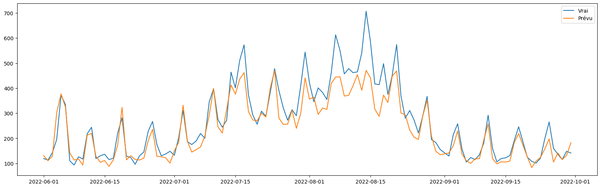

# 🍞 Sales Forecasting and Reducing Waste in a Bakery

## 📌 Problem
Bakeries face a daily dilemma: producing enough to meet demand without generating excessive unsold products.
Food waste represents a significant financial cost, which can be reduced through better sales forecasting.

This project aims to build a **demand forecasting model** for a French bakery to reduce waste and optimize production.

---

## 📊 Dataset
- **Historical sales (`sales.csv`)**
  Data from a French bakery (Kaggle dataset).

- **Weather data ([Open-Meteo API](https://open-meteo.com/))**
  Features such as temperature and rainfall, which impact customer demand.

- **School holidays**
  Enriched using the Python package [`vacances-scolaires-france`](https://pypi.org/project/vacances-scolaires-france/) (v0.10.0).

---

## ⚙️ Methodology
1. **Data preprocessing**
   - Cleaning and aggregating daily sales.
   - Enriching the dataset with weather and school holiday information.

2. **Modeling**
   - Baseline model (moving average).
   - Several machine learning models were tested.
   - **LightGBM** achieved the best performance.

3. **Results**
   - The model captures trends well but **underestimates sales in August**, likely due to a local event not represented in the data.
   - Limitation: the dataset only covers **one year**, which reduces statistical significance.

---

## 💰 Estimated Economic Impact
The model helps reduce unsold products and optimize production.
Estimated yearly savings per product:

| Product              | Units Saved/day | Savings/day (€) | Savings/year (€) |
|----------------------|-----------------|-----------------|------------------|
| Traditional Baguette | 27.48           | 8.24            | 2,761.74         |
| Croissant            | 19.21           | 5.76            | 1,930.37         |
| Pain au chocolat     | 11.27           | 3.38            | 1,133.02         |
| Baguette             | 3.44            | 0.77            | 259.54           |
| Special Bread        | 0.51            | 0.31            | 102.33           |
| **TOTAL**            | -               | -               | **6,186.99**     |

➡️ Around **€6,000 saved per year** for this bakery.

---

## 📈 Business Context
- **Observed turnover:** €507,564
- **Annualized turnover:** €279,160
- The bakery is positioned around the average of the sector.

Thus, the predicted savings represent **~2% of annual revenue**.

---

## 🖼️ Example Result

---

## 🚀 Future Improvements
- Collect data over multiple years to better capture seasonality.
- Add local event features (markets, festivals, holidays).
- Explore advanced time series models such as **RNN/LSTM** or **transformers**.

---

## 🛠️ Tech Stack
- **Python** (pandas, numpy, scikit-learn, lightgbm, matplotlib, seaborn)
- **Open-Meteo API**
- **vacances-scolaires-france 0.10.0**

---

## 📂 Repository Structure
├── data/ # Raw data / sample data
├── notebooks/ # Jupyter notebooks (exploration + modeling)
├── assets/ # Plots and visuals
├── requirements.txt # Dependencies
└── README.md # Project documentation

---

## ✨ Author
Project by **Mathieu Zinzen** (2025).
